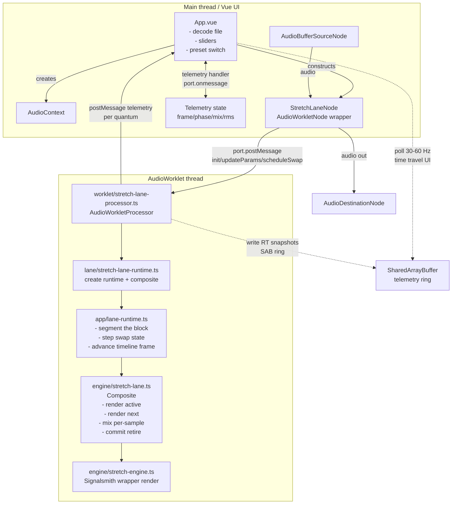

# seqlok-signalsmith-stretch

A minimal, deterministic, glitch-free demo lane that runs **Signalsmith Stretch** inside an `AudioWorkletProcessor`,
using a Seqlok-style hot-swap protocol:

**spawn → prime → preWarm → crossFade → retire**

This repo is meant to be “show, don’t tell” for:

* RT-safe hotswapping (reject-while-busy, no overlapping swaps)
* segment-correct rendering (respecting offsets inside an audio block)
* input segment caching (both engines see identical samples during prewarm/crossfade)
* per-sample crossfade ramps derived from fade geometry (not UI progress)
* a path toward a Debug Lab UI with “time travel” via SAB telemetry snapshots

---

## What this demo proves

When the invariants are respected, you can swap structural DSP configurations during playback without:

* clicks at boundaries (retire correctness + segmentOffset correctness)
* metallic combing during fades (latency alignment + input identity)
* zipper noise (per-sample ramps, not per-block gains)
* random crackles from GC / message spam (no hot-path allocation, no per-quantum postMessage in the final design)

---

## Repository layout

This is the full `src/` tree:

```
src
├── App.vue
├── app
│   ├── lane-runtime.ts
│   └── window-classes.ts
├── engine
│   ├── engine-bank.ts
│   ├── engine-kind.ts
│   ├── stretch-config.ts
│   ├── stretch-engine.ts
│   └── stretch-lane.ts
├── lane
│   ├── stretch-lane-node.ts
│   └── stretch-lane-runtime.ts
├── main.ts
├── style.css
└── worklet
    └── stretch-lane-processor.ts
```

### Index map (quick “what is this?”)

| File                                    | Runs on             | Role                                                                                                                 |
|-----------------------------------------|---------------------|----------------------------------------------------------------------------------------------------------------------|
| `src/main.ts`                           | Main thread         | Mounts the Vue app                                                                                                   |
| `src/App.vue`                           | Main thread         | UI: starts AudioContext, loads worklet module, constructs node, sends control messages, renders telemetry            |
| `src/lane/stretch-lane-node.ts`         | Main thread         | `AudioWorkletNode` wrapper: `init`, `updateParams`, `scheduleSwap` via `port.postMessage`                            |
| `src/worklet/stretch-lane-processor.ts` | AudioWorklet thread | `AudioWorkletProcessor`: receives control messages, processes audio, calls runtime, produces output, emits telemetry |
| `src/lane/stretch-lane-runtime.ts`      | AudioWorklet thread | Wires lane runtime + composite; exposes `processBlock/updateParams/reconfigureStructurally` to the processor         |
| `src/app/lane-runtime.ts`               | AudioWorklet thread | Segmenter + swap-stepper: slices blocks into segments, steps the swap state machine, advances time                   |
| `src/engine/stretch-lane.ts`            | AudioWorklet thread | Composite: owns engine bank, buffers, mixing/crossfade, schedules swaps                                              |
| `src/engine/stretch-engine.ts`          | AudioWorklet thread | Signalsmith wrapper: “pure DSP” render entrypoint (no policy)                                                        |
| `src/engine/stretch-config.ts`          | Shared              | Types + config surfaces (`StretchStructuralConfig`, `StretchParams`)                                                 |
| `src/app/window-classes.ts`             | Main thread         | UI helper (optional; delete if unused)                                                                               |
| `src/style.css`                         | Main thread         | Styles                                                                                                               |

---

## Runtime interaction graph



---

## The rules that make it glitch-free

### 1) Never reconfigure the live engine

Structural change = spawn a new engine instance, then swap using the protocol:

**spawn → prime → preWarm → crossFade → retire**

No “configure() on the active engine”.

### 2) Audio thread does not allocate

In any RT-reachable code path:

* no `new Float32Array`, `new Array`, object literals in per-step loops
* avoid `subarray()` churn in hot loops (it allocates view objects)
* no per-quantum logging / JSON stringify / exceptions

### 3) Audio thread does not instantiate WASM

No `createModule()` (or anything Emscripten-like) in `process()` or any message handler that could run during playback.

### 4) Input is segment-cached

For each render **segment**:

* pull input exactly once into a scratch buffer
* both engines (active + next) read the **same scratch samples** during prewarm/crossfade

If you “pull twice” during crossfade, you are literally crossfading two different timelines. That produces “sometimes it
sums weird”, phase chaos, and boundary clicks.

### 5) segmentOffset is respected everywhere

If your runtime slices blocks into segments, every read/write uses:

* `base = segmentOffset`
* `i in [0..frames)` maps to `base + i` in the block buffers

Ignoring this produces periodic ticks from stale samples.

### 6) Crossfade ramps use fade geometry, not UI progress

The hotswap decision must expose fade geometry:

* `fadeTotalFrames`
* `fadeDoneFramesAtBlockStart`
* `fadeDoneFramesAtBlockEnd`

Then per sample:

* `t = clamp01((doneStart + i) / total)`

A single `t` per block = stepped fade = zipper noise and end-of-fade crackles.

### 7) Retire boundary is internally consistent

At the boundary:

* rendering and status must agree which engine is “active output” for that step
* a safe rule is: during `retireNow`, treat the committed engine as active output

This avoids the classic “click exactly at end of fade”.

### 8) Latency alignment before mixing

If engines have different internal latency, you must align them or your fade will comb-filter.

Recommended:

* choose a constant session `laneDelayFrames = max(latency in pool)`
* delay the faster engine more via preallocated ring buffers
* ensure prewarm advances the same delay compensation path as crossfade

---

## Spam behavior: does reject-while-busy solve it?

Yes, for safety and determinism.

* **Reject-while-busy** prevents overlapping swaps from stacking and corrupting state.
* It guarantees “at most one in-flight swap”.

To make spam feel good (not “button dead”), use a **UI-side coalescer**:

* while swap is in-flight, record only the latest requested config
* when the lane reports `idle`, schedule that latest request immediately

This keeps the RT rule (“reject while busy”) while providing a “latest-wins” UX.

---

## Debug Lab roadmap: time travel telemetry (target)

The final showcase UI should not depend on per-quantum `postMessage`.

Target design:

* Audio thread writes **per-segment snapshots** into a preallocated **SAB ring**
* UI polls at ~30–60 Hz
* UI can freeze live updates and scrub the ring history (“time travel”)
* optional bookmarks on swap events (spawn/prime/prewarm/crossfade/retire)

Suggested snapshot fields (numbers only, fixed size):

* timeline: `frame`, `blockFrames`, `segmentOffset`, `segmentFrames`
* swap: `phase`, `ticketId`, `activeKind`, `nextKind`
* fade geometry: `fadeTotalFrames`, `fadeDoneStart`, `fadeDoneEnd`
* alignment: `laneDelayFrames`, `padActive`, `padNext`
* safety: `peak`, `rms`, `nanCount`, `overrunMicros`
* guards: `inputHash`, `offsetOverwriteFlag`, `doublePullFlag`, `retireMismatchFlag`

This is the centerpiece for a “glitch-free hotswap” demo: not just sound, but proof.

---

## Running the demo

Use the scripts in `package.json` (typical Vite flow):

* `pnpm install`
* `pnpm dev`
* open the app, load audio, move params, schedule swaps

(Keep the worklet module import via Vite `?url` pattern for correct runtime URLs.)

---

## “Clean” policy for this repo

* One canonical worklet processor: `src/worklet/stretch-lane-processor.ts`
* One canonical node wrapper: `src/lane/stretch-lane-node.ts`
* No duplicate processors or “legacy” parallel pipelines
* The audio-thread path stays boring: deterministic, allocation-free, measurable

---

## License / third-party

See `THIRD_PARTY_NOTICES.md` and `third_party/licenses/*` for Signalsmith licensing and notices.
